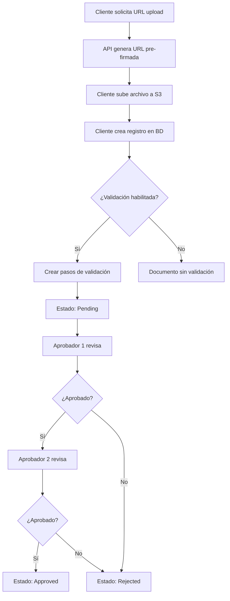

# 📄 ERP Document Management System

<div align="center">


**Sistema de gestión de documentos empresariales con integración AWS S3 y flujos de validación**

[Características](#-características) • [Instalación](#-instalación) • [APIs](#-documentación-de-apis) • [Estructura](#-estructura-del-proyecto)

</div>

---

## 📋 Tabla de Contenidos

- [Descripción](#-descripción)
- [Características](#-características)
- [Tecnologías](#-tecnologías)
- [Requisitos Previos](#-requisitos-previos)
- [Instalación](#-instalación)
- [Configuración](#-configuración)
- [Documentación de APIs](#-documentación-de-apis)
- [Estructura del Proyecto](#-estructura-del-proyecto)
- [Modelos de Datos](#-modelos-de-datos)
- [Flujo de Trabajo](#-flujo-de-trabajo)
- [Comandos de Gestión](#-comandos-de-gestión)
- [Testing](#-testing)

---

## 🎯 Descripción

Sistema ERP para la gestión de documentos empresariales que permite:

- ✅ **Almacenamiento seguro** de archivos en AWS S3 mediante URLs pre-firmadas
- ✅ **Gestión de documentos** con metadatos completos
- ✅ **Flujos de validación** multi-etapa con aprobadores
- ✅ **Trazabilidad completa** de aprobaciones y rechazos
- ✅ **Asociación flexible** de documentos a entidades del dominio (vehículos, empleados, etc.)

---

## ✨ Características

| Característica | Descripción |
|---------------|-------------|
| 🔐 **URLs Pre-firmadas** | Generación segura de URLs temporales para upload/download desde S3 |
| 📝 **Gestión de Documentos** | CRUD completo con metadatos (tipo, tamaño, MIME type, hash) |
| ✅ **Flujos de Validación** | Sistema multi-etapa configurable con aprobadores asignados |
| 🔄 **Estados de Validación** | Pending, Approved, Rejected con actualización automática |
| 🏢 **Multi-empresa** | Soporte para múltiples compañías en el mismo sistema |
| 🔗 **Entidades del Dominio** | Asociación flexible a vehículos, empleados u otras entidades |
| 📊 **Trazabilidad** | Historial completo de acciones con fechas y razones |
| 🛡️ **Transacciones Atómicas** | Garantía de consistencia de datos en operaciones complejas |

---

## 🛠️ Tecnologías

- **Backend Framework**: Django 5.2.8
- **API Framework**: Django REST Framework 3.14+
- **Base de Datos**: PostgreSQL
- **Almacenamiento**: AWS S3
- **Lenguaje**: Python 3.8+
- **Autenticación**: Django Auth (configurable)

---

## 📦 Requisitos Previos

- Python 3.8 o superior
- PostgreSQL
- Cuenta AWS con S3 configurado
- Credenciales AWS (Access Key ID y Secret Access Key)

---

## 🚀 Instalación

### 1. Clonar el repositorio

```bash
git clone <repository-url>
cd ERP_PROJECT
```

### 2. Crear entorno virtual

```bash
python -m venv venv

# Windows
venv\Scripts\activate

# Linux/Mac
source venv/bin/activate
```

### 3. Instalar dependencias

```bash
pip install -r requirements.txt
```

### 4. Configurar base de datos

```bash
# Crear base de datos PostgreSQL
createdb erp_documents

# Ejecutar migraciones
python manage.py migrate
```

### 5. Crear superusuario

```bash
python manage.py createsuperuser
```

---

## ⚙️ Configuración

### Variables de Entorno

Crear un archivo `.env` en la raíz del proyecto:

```env
# Database
DB_NAME=erp_documents
DB_USER=postgres
DB_PASSWORD=tu_password
DB_HOST=localhost
DB_PORT=5432

# AWS S3
AWS_ACCESS_KEY_ID=tu_access_key_id
AWS_SECRET_ACCESS_KEY=tu_secret_access_key
AWS_STORAGE_BUCKET_NAME=tu_bucket_name
AWS_REGION=us-east-2
AWS_PRESIGNED_URL_EXPIRATION=3600

# Django
SECRET_KEY=tu_secret_key
DEBUG=True
```

### Configuración de AWS S3

1. Crear un bucket en AWS S3
2. Configurar políticas de acceso según tus necesidades
3. Obtener las credenciales de acceso (IAM)

---

## 📚 Documentación de APIs

Base URL: `http://localhost:8000/api/documents/`

### 🔗 Endpoints Disponibles

| Método | Endpoint | Descripción |
|--------|----------|-------------|
| `POST` | `/presigned-upload-url/` | Generar URL pre-firmada para subir archivo |
| `POST` | `/presigned-download-url/` | Generar URL pre-firmada para descargar archivo |
| `POST` | `/` | Crear registro de documento en BD |
| `POST` | `/{document_id}/approve/` | Aprobar documento |
| `POST` | `/{document_id}/reject/` | Rechazar documento |

---

### 1️⃣ Generar URL Pre-firmada para Upload

**Endpoint:** `POST /api/documents/presigned-upload-url/`

**Descripción:** Genera una URL pre-firmada temporal para subir un archivo directamente a S3.

**Request Body:**
```json
{
  "file_name": "documento.pdf",
  "content_type": "application/pdf",
  "bucket_key": "uploads/optional/path/documento.pdf"  // Opcional
}
```

**Response 200 OK:**
```json
{
  "upload_url": "https://s3.amazonaws.com/bucket/...",
  "fields": {
    "key": "uploads/uuid/documento.pdf",
    "Content-Type": "application/pdf",
    "AWSAccessKeyId": "...",
    "policy": "...",
    "signature": "..."
  },
  "bucket_key": "uploads/uuid/documento.pdf"
}
```

**Ejemplo con cURL:**
```bash
curl -X POST http://localhost:8000/api/documents/presigned-upload-url/ \
  -H "Content-Type: application/json" \
  -d '{
    "file_name": "test.pdf",
    "content_type": "application/pdf"
  }'
```

**Subir archivo a S3:**
```bash
curl -X POST {upload_url} \
  -F "key={fields.key}" \
  -F "Content-Type={fields.Content-Type}" \
  -F "AWSAccessKeyId={fields.AWSAccessKeyId}" \
  -F "policy={fields.policy}" \
  -F "signature={fields.signature}" \
  -F "file=@/path/to/file.pdf"
```

---

### 2️⃣ Generar URL Pre-firmada para Download

**Endpoint:** `POST /api/documents/presigned-download-url/`

**Descripción:** Genera una URL pre-firmada temporal para descargar un archivo desde S3.

**Request Body:**
```json
{
  "bucket_key": "uploads/uuid/documento.pdf"
}
```

**Response 200 OK:**
```json
{
  "download_url": "https://s3.amazonaws.com/bucket/...?AWSAccessKeyId=...",
  "bucket_key": "uploads/uuid/documento.pdf"
}
```

**Ejemplo con cURL:**
```bash
curl -X POST http://localhost:8000/api/documents/presigned-download-url/ \
  -H "Content-Type: application/json" \
  -d '{
    "bucket_key": "uploads/uuid/documento.pdf"
  }'
```

---

### 3️⃣ Crear Documento

**Endpoint:** `POST /api/documents/`

**Descripción:** Crea un registro de documento en la base de datos. El archivo debe existir previamente en S3.

**Request Body:**
```json
{
  "company_id": "550e8400-e29b-41d4-a716-446655440000",
  "entity": {
    "entity_type": "vehicle",
    "entity_id": "123e4567-e89b-12d3-a456-426614174000"
  },
  "document": {
    "name": "Documento de Vehículo",
    "mime_type": "application/pdf",
    "size_bytes": 1024000,
    "bucket_key": "uploads/uuid/documento.pdf"
  },
  "validation_flow": {
    "enabled": true,
    "steps": [
      {
        "order": 1,
        "approver_user_id": "approver-uuid-1"
      },
      {
        "order": 2,
        "approver_user_id": "approver-uuid-2"
      }
    ]
  }
}
```

**Tipos de Entidad Válidos:**
- `vehicle`
- `employee`
- `other`

**Response 201 Created:**
```json
{
  "id": "document-uuid",
  "name": "Documento de Vehículo",
  "document_type": "OTRO",
  "size": 1024000,
  "mime_type": "application/pdf",
  "bucket_key": "uploads/uuid/documento.pdf",
  "validation_status": "P",
  "created_at": "2024-01-15T10:30:00Z",
  "updated_at": "2024-01-15T10:30:00Z"
}
```

**Ejemplo con cURL:**
```bash
curl -X POST http://localhost:8000/api/documents/ \
  -H "Content-Type: application/json" \
  -d '{
    "company_id": "550e8400-e29b-41d4-a716-446655440000",
    "entity": {
      "entity_type": "vehicle",
      "entity_id": "123e4567-e89b-12d3-a456-426614174000"
    },
    "document": {
      "name": "Documento de Vehículo",
      "mime_type": "application/pdf",
      "size_bytes": 1024000,
      "bucket_key": "uploads/uuid/documento.pdf"
    }
  }'
```

---

### 4️⃣ Aprobar Documento

**Endpoint:** `POST /api/documents/{document_id}/approve/`

**Descripción:** Aprueba un paso de validación del documento. Si se aprueba un paso, se aprueban automáticamente todos los pasos anteriores.

**Request Body:**
```json
{
  "approver_user_id": "approver-uuid",
  "reason": "Documento revisado y aprobado"  // Opcional
}
```

**Response 200 OK:**
```json
{
  "id": "document-uuid",
  "name": "Documento de Vehículo",
  "validation_status": "A",
  ...
}
```

**Ejemplo con cURL:**
```bash
curl -X POST http://localhost:8000/api/documents/{document_id}/approve/ \
  -H "Content-Type: application/json" \
  -d '{
    "approver_user_id": "approver-uuid",
    "reason": "Documento revisado y aprobado"
  }'
```

---

### 5️⃣ Rechazar Documento

**Endpoint:** `POST /api/documents/{document_id}/reject/`

**Descripción:** Rechaza un paso de validación del documento. Al rechazar, el documento queda en estado "Rejected".

**Request Body:**
```json
{
  "approver_user_id": "approver-uuid",
  "reason": "Documento incompleto, falta información"  // Opcional
}
```

**Response 200 OK:**
```json
{
  "id": "document-uuid",
  "name": "Documento de Vehículo",
  "validation_status": "R",
  ...
}
```

**Ejemplo con cURL:**
```bash
curl -X POST http://localhost:8000/api/documents/{document_id}/reject/ \
  -H "Content-Type: application/json" \
  -d '{
    "approver_user_id": "approver-uuid",
    "reason": "Documento incompleto"
  }'
```

---

## 🏗️ Estructura del Proyecto

```
ERP_PROJECT/
├── documents/                    # App principal de documentos
│   ├── management/
│   │   └── commands/
│   │       ├── test_api.py      # Comando para probar APIs
│   │       └── seed_data.py     # Comando para datos iniciales
│   ├── migrations/               # Migraciones de BD
│   ├── models.py                # Modelos de datos
│   ├── serializers.py           # Serializers DRF
│   ├── views.py                 # Vistas API
│   ├── urls.py                  # Rutas de la app
│   ├── aws_services.py          # Servicios AWS S3
│   ├── utils.py                 # Utilidades
│   └── admin.py                 # Configuración admin Django
├── erp_project/                 # Configuración del proyecto
│   ├── settings.py              # Configuración Django
│   ├── urls.py                  # URLs principales
│   └── wsgi.py                  # WSGI config
├── .env                         # Variables de entorno (no commitear)
├── requirements.txt             # Dependencias Python
└── README.md                    # Este archivo
```

---

## 🗄️ Modelos de Datos

### Modelos Principales

#### `Company`
Representa una empresa en el sistema.

| Campo | Tipo | Descripción |
|-------|------|-------------|
| `id` | UUID | Identificador único |
| `name` | String | Nombre de la empresa |
| `nit` | String | NIT único |
| `active` | Boolean | Estado activo/inactivo |

#### `DomainEntity`
Entidad del dominio a la que se asocian documentos (vehículo, empleado, etc.).

| Campo | Tipo | Descripción |
|-------|------|-------------|
| `id` | UUID | Identificador único |
| `entity_type` | Choice | Tipo: VEHICLE, EMPLOYEE, OTHER |
| `object_id` | UUID | ID de la entidad en su sistema |
| `name` | String | Nombre descriptivo |

#### `Document`
Documento principal con metadatos.

| Campo | Tipo | Descripción |
|-------|------|-------------|
| `id` | UUID | Identificador único |
| `company` | FK | Empresa propietaria |
| `domain_entity` | FK | Entidad asociada |
| `name` | String | Nombre del documento |
| `mime_type` | String | Tipo MIME |
| `size` | BigInteger | Tamaño en bytes |
| `bucket_key` | String | Ruta en S3 (único) |
| `validation_status` | Choice | P/A/R/None |

#### `DocumentValidation`
Paso de validación dentro del flujo.

| Campo | Tipo | Descripción |
|-------|------|-------------|
| `id` | UUID | Identificador único |
| `document` | FK | Documento asociado |
| `step_order` | Integer | Orden del paso |
| `assigned_approver` | FK | Aprobador asignado |
| `actor_approver` | FK | Aprobador que ejecutó la acción |
| `status` | Choice | P/A/R |
| `reason` | Text | Razón del aprobado/rechazo |

#### `Approver`
Aprobador del sistema vinculado a un usuario Django.

| Campo | Tipo | Descripción |
|-------|------|-------------|
| `id` | UUID | Identificador único |
| `user` | OneToOne | Usuario Django |
| `active` | Boolean | Estado activo |

---

## 🔄 Flujo de Trabajo

### Flujo Completo de Documento



### Estados de Validación

| Estado | Código | Descripción |
|--------|--------|-------------|
| Sin Validación | `None` | Documento sin flujo de validación |
| Pendiente | `P` | Esperando aprobación |
| Aprobado | `A` | Todos los pasos aprobados |
| Rechazado | `R` | Al menos un paso rechazado |

---

## 🛠️ Comandos de Gestión

### Probar APIs

Comando para probar el flujo completo de APIs:

```bash
python manage.py test_api
```

**Configuración en el código:**
- `API_BASE_URL`: URL base de la API
- `FILE_PATH`: Ruta del archivo a subir
- `CREATE_DB_DOCUMENT`: Crear registro en BD
- `DOWNLOAD_FILE`: Descargar archivo después
- `COMPANY_ID`: UUID de la empresa
- `ENTITY_TYPE`: Tipo de entidad
- `ENTITY_ID`: UUID de la entidad

### Datos Iniciales

Comando para crear datos de prueba:

```bash
python manage.py seed_data
```

---

## 🧪 Testing

### Ejecutar Tests

```bash
python manage.py test
```

### Probar Endpoints Manualmente

Usar el comando `test_api` o herramientas como:

- **Postman**
- **cURL**
- **HTTPie**
- **Swagger/OpenAPI** (si está configurado)

---

## 📝 Notas Importantes

### Seguridad

- ⚠️ En producción, cambiar `AllowAny` a `IsAuthenticated` en `settings.py`
- ⚠️ Usar HTTPS en producción
- ⚠️ Configurar CORS apropiadamente
- ⚠️ Rotar credenciales AWS regularmente

### Transacciones

- Las operaciones de creación y validación usan `@transaction.atomic` para garantizar consistencia
- Si falla cualquier paso, se revierte toda la operación

### URLs Pre-firmadas

- Las URLs tienen expiración configurable (default: 3600 segundos)
- No almacenar URLs pre-firmadas, generarlas bajo demanda

---

## 🤝 Contribución

1. Fork el proyecto
2. Crea una rama para tu feature (`git checkout -b feature/AmazingFeature`)
3. Commit tus cambios (`git commit -m 'Add some AmazingFeature'`)
4. Push a la rama (`git push origin feature/AmazingFeature`)
5. Abre un Pull Request

---

## 📄 Licencia

Este proyecto es privado y confidencial.

---

## 👥 Autor

Desarrollado como parte de la prueba técnica ERP.

---

<div align="center">

**⭐ Si este proyecto te fue útil, considera darle una estrella ⭐**

Made with ❤️ using Django

</div>

